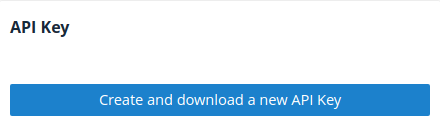
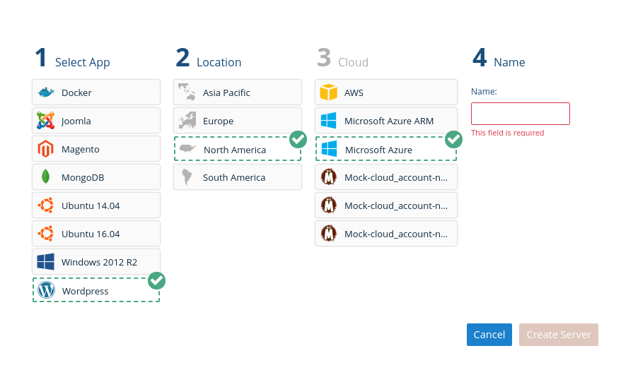
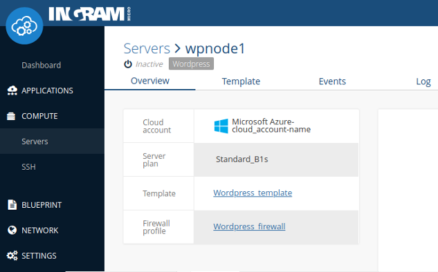
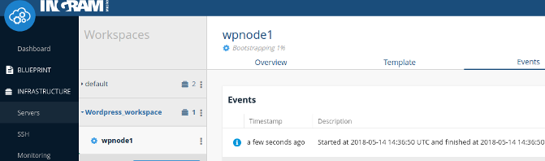
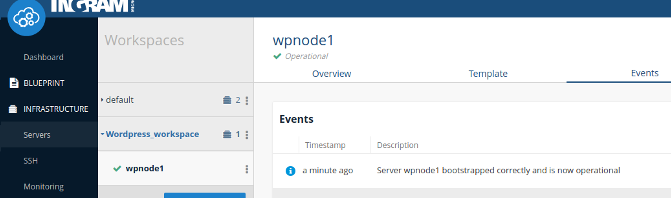
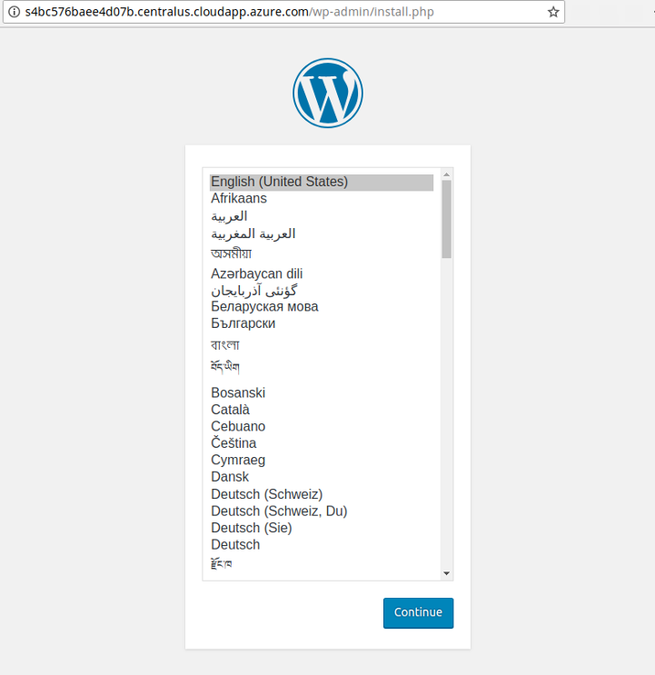

# IMCO CLI / Go Library

[](https://godoc.org/github.com/ingrammicro/concerto)
[](https://codecov.io/github/ingrammicro/concerto?branch=master)
[](https://travis-ci.org/ingrammicro/concerto)
[](http://goreportcard.com/report/ingrammicro/concerto)

Ingram Micro Cloud Orchestrator Command Line Interface (aka IMCO CLI) allows you to interact with IMCO features, and build your own scripts calling IMCO's API.

If you are already using IMCO CLI, and only want to obtain the latest version, download IMCO CLI from <https://github.com/ingrammicro/concerto/releases/latest>

> NOTE: IMCO CLI is named as `concerto` in terms of the binary and executable.

If you want to build the CLI using the source code, please, take into account that the master branch is the adequate one to be used for latest stable and published version of IMCO CLI.

## Table of Contents

- [Setup](#setup)
  - [Pre-requisites](#pre-requisites)
  - [Manual Setup](#manual-setup)
  - [Linux and OSX](#linux-and-osx)
    - [Configuration](#configuration)
    - [Binaries](#binaries)
  - [Environment variables](#environment-variables)
  - [Troubleshooting](#troubleshooting)
- [Usage](#usage)
  - [Wizard](#wizard)
    - [Wizard Use Case](#wizard-use-case)
  - [Blueprint](#blueprint)
    - [Blueprint Use Case](#blueprint-use-case)
      - [Template OS](#template-os)
      - [Service List](#service-list)
      - [Instantiate a server](#instantiate-a-server)
  - [Firewall Management](#firewall-management)
    - [Firewall Update Case](#firewall-update-case)
  - [Blueprint Update](#blueprint-update)
    - [Blueprint Update Case](#blueprint-update-case)
- [Contribute](#contribute)

## Setup

### Pre-requisites

Before setting up the CLI, you will need a IMCO account, and an API key associated with your account.

> NOTE: The API Endpoint server value depends on the targeted IMCO platform domain: <https://clients.{IMCO_DOMAIN}:886>

Once your account has been provisioned, we recommend you to follow the configuration guide indicated below: [manual setup](#manual-setup)

## Manual Setup

Use IMCO's Web UI to navigate the menus to `Settings` > `User Details` and scroll down until you find the `New API Key` button.



Pressing `New API Key` will download a compressed file that contains the necessary files to authenticate with IMCO API and manage your infrastructure. `Keep it safe`.

Extract the contents with your zip compressor of choice and continue using the setup guide for your O.S.

## Linux and OSX

### Configuration

IMCO CLI configuration will usually be located in your personal folder under `.concerto`. If you are using root, CLI will look for contiguration files under `/etc/imco`.
We will assume that you are not root, so create the folder and drop the certificates to this location:

```bash
$ mkdir -p ~/.concerto/ssl/
$ unzip -x api-key.zip -d ~/.concerto/ssl
```

IMCO CLI expects a configuration file to be present containing:

- API Endpoint
- Log file
- Log level
- Certificate location

This command will generate the file `~/.concerto/client.xml` with suitable contents for most users:

```bash
$ cat <<EOF > ~/.concerto/client.xml
<concerto version="1.0" server="https://clients.{IMCO_DOMAIN}:886/" log_file="/var/log/concerto-client.log" log_level="info">
 <ssl cert="$HOME/.concerto/ssl/cert.crt" key="$HOME/.concerto/ssl/private/cert.key" server_ca="$HOME/.concerto/ssl/ca_cert.pem" />
</concerto>
EOF
```

> NOTE: Please, remember to replace `{IMCO_DOMAIN}` with the right domain of your IMCO platform.

We should have in your `.concerto` folder this structure:

```bash
$HOME/.concerto
├── client.xml
└── ssl
    ├── ca_cert.pem
    ├── cert.crt
    └── private
        └── cert.key
```

### Binaries

Download linux binaries for `Linux` or for `OSX` from <https://github.com/ingrammicro/concerto/releases/latest> and place it in your path.

> NOTE: Please, remember to replace `{LATEST_RELEASE}` with the right tagged release.

Linux:

```bash
$ sudo curl -o /usr/local/bin/concerto https://github.com/ingrammicro/concerto/releases/download/{LATEST_RELEASE}/concerto.amd64.linux
$ sudo chmod +x /usr/local/bin/concerto
```

OSX:

```bash
$ sudo curl -o /usr/local/bin/concerto https://github.com/ingrammicro/concerto/releases/download/{LATEST_RELEASE}/concerto.amd64.darwin
$ sudo chmod +x /usr/local/bin/concerto
```

To test the binary execute `concerto` without parameters

```bash
$ concerto
NAME:
   concerto - Manages communication between Host and IMCO Platform

USAGE:
   concerto [global options] command [command options] [arguments...]

VERSION:
   0.6.1

AUTHOR:
   Concerto Contributors <https://github.com/ingrammicro/concerto>

COMMANDS:
     blueprint, bl  Manages blueprint commands for scripts, services and templates
     cloud, clo     Manages cloud related commands for workspaces, servers, generic images, ssh profiles, cloud providers, server plans and Saas providers
     events, ev     Events allow the user to track their actions and the state of their servers
     network, net   Manages network related commands for firewall profiles
     settings, set  Provides settings for cloud accounts
     setup, se      Configures and setups concerto cli environment
     wizard, wiz    Manages wizard related commands for apps, locations, cloud providers, server plans
...
```

To test that certificates are valid, and that we can communicate with IMCO server, obtain the list of workspaces at your IMCO account using this command

```bash
$ concerto cloud workspaces list
ID                         NAME               DEFAULT        SSH_PROFILE_ID             FIREWALL_PROFILE_ID
5aabb7521de0240abb00000e   default            true           5aabb7521de0240abb00000d   5aabb7521de0240abb00000c
```

## Environment variables

When using IMCO CLI you can override configuration parameters using the following environment variables:

Env. Variable | Descripcion
------------------------|---------------------
`CONCERTO_CA_CERT` | CA certificate used with the API endpoint.
`CONCERTO_CLIENT_CERT` | Client certificate used with the API endpoint.
`CONCERTO_CLIENT_KEY` | Client key used with the API endpoint.
`CONCERTO_CONFIG` | Config file to be read by Concerto CLI.
`CONCERTO_ENDPOINT` | IMCO API endpoint
`CONCERTO_URL` | IMCO web site URL.

## Troubleshooting

If you got an error executing IMCO CLI:

- execute `which concerto` to make sure that the binary is installed.
- execute `ls -l /path/to/concerto` with the output from the previous command, and check that you have execute permissions.
- execute `$PATH` and search for the path where `concerto` is installed. If `concerto` isn't in the path, move it to a `$PATH` location.
- check that your internet connection can reach `clients.{IMCO_DOMAIN}`
- make sure that your firewall lets you access to <https://clients.{IMCO_DOMAIN}:886>
- check that `client.xml` is pointing to the correct certificates location
- if `concerto` executes but only shows server commands, you are probably trying to use `concerto` from a commissioned server, and the configuration is being read from `/etc/imco`. If that's the case, you should leave `concerto` configuration untouched so that server commands are available for our remote management.

## Usage

We include the most common use cases here. If you feel there is a missing a use case here, open an github issue <https://github.com/ingrammicro/concerto/issues/new>.

## Wizard

The Wizard command for IMCO CLI is the command line version of our `Quick add server` in the IMCO's Web UI.



Wizard is the quickest way to install a well known stack in a cloud server. You can get an idea of what the wizard does using the command `concerto wizard` without further subcommands:

```bash
$ concerto wizard
NAME:
    - Manages wizard related commands for apps, locations, cloud providers, server plans

USAGE:
    command [command options] [arguments...]

COMMANDS:
     apps             Provides information about apps
     cloud_providers  Provides information about cloud providers
     locations        Provides information about locations
     server_plans     Provides information about server plans
...
```

IMCO CLI Wizard lets you select the application layer, the location, the cloud provider account for that location, and finally the hostname. IMCO CLI Wizard takes care of the details.

### Wizard Use Case

Let's type `concerto wizard apps list` to check what applications we can instantiate as cloud servers using IMCO CLI wizard.

```bash
$ concerto wizard apps list
ID                         NAME              FLAVOUR_REQUIREMENTS   GENERIC_IMAGE_ID
5aabb75a1de0240abb000185   Ubuntu 14.04      {}                     5aabb7551de0240abb000064
5aabb75a1de0240abb000186   Ubuntu 16.04      {}                     5aabb7551de0240abb000065
5aabb75a1de0240abb000187   Windows 2012 R2   {"memory":4096}        5aabb7551de0240abb000066
5aabb75a1de0240abb000188   Joomla            {"memory":1024}        5aabb7551de0240abb000064
5aabb75a1de0240abb000189   Magento           {"memory":1024}        5aabb7551de0240abb000064
5aabb75b1de0240abb00018a   MongoDB           {}                     5aabb7551de0240abb000064
5aabb75b1de0240abb00018b   Wordpress         {"memory":1024}        5aabb7551de0240abb000064
5aabb75b1de0240abb00018c   Docker            {"memory":2048}        5aabb7551de0240abb000064
```

You can choose whatever application/stack is fine for your purpose, we choose `Wordpress`. Take note of the application identifier, `5aabb75b1de0240abb00018b` for `Wordpress`.

We will also need the location where we want our server to be instantiated. Execute `concerto wizard locations list` to get the possible locations and its identifier.

```bash
$ concerto wizard locations list
ID                         NAME
5aabb7551de0240abb000060   North America
5aabb7551de0240abb000061   Europe
5aabb7551de0240abb000062   Asia Pacific
5aabb7551de0240abb000063   South America
```

Take note of your preferred location. We will use `5aabb7551de0240abb000060` for `North America`.

When using IMCO's Web UI, the wizard may take care of filtering appropriate cloud accounts for that provider and location. However, by using the CLI, it is the user's responsibility to choose a provider cloud account for that application/stack and location; and a server plan capable of instantiating the stack in that location.
To show all possible cloud providers execute this command:

```bash
$ concerto wizard cloud_providers list --app_id 5aabb75b1de0240abb00018b --location_id 5aabb7551de0240abb000060
ID                         NAME
5aabb7511de0240abb000001   AWS
5aabb7511de0240abb000002   Mock
5aabb7511de0240abb000004   Microsoft Azure ARM
5aabb7511de0240abb000005   Microsoft Azure
```

It's necessary to retrieve the adequeate Cloud Account ID for `Microsoft Azure` Cloud Provider, in our case `5aabb7531de0240abb000024`.
We will choose `Microsoft Azure`, whose ID is `5aabb7511de0240abb000005`:

```bash
$ concerto settings cloud_accounts list
ID                         NAME                                     CLOUD_PROVIDER_ID          CLOUD_PROVIDER_NAME
5aabb7521de0240abb00001b   AWS-cloud_account-name                   5aabb7511de0240abb000001   AWS
5aabb7521de0240abb00001c   Mock-cloud_account-name-0                5aabb7511de0240abb000002   Mock
5aabb7531de0240abb00001d   Mock-cloud_account-name-1                5aabb7511de0240abb000002   Mock
5aabb7531de0240abb00001e   Mock-cloud_account-name-2                5aabb7511de0240abb000002   Mock
5aabb7531de0240abb000020   DigitalOcean-cloud_account-name          5aabb7511de0240abb000003   DigitalOcean
5aabb7531de0240abb000022   Microsoft Azure ARM-cloud_account-name   5aabb7511de0240abb000004   Microsoft Azure ARM
5aabb7531de0240abb000024   Microsoft Azure-cloud_account-name       5aabb7511de0240abb000005   Microsoft Azure
5aba0656425b5d0c64000001   VMWare-cloud_account-name                5aba04be425b5d0c16000000   VCloud
5aba066c425b5d0c64000002   VMWare-Routed-cloud_account-name         5aba04be425b5d0c16000000   VCloud
```

Now that we have all the data that we need, commission the server:

```bash
$ concerto wizard apps deploy --id 5aabb75b1de0240abb00018b --location_id 5aabb7551de0240abb000060 --cloud_account_id 5aabb7531de0240abb000024 --hostname wpnode1
ID:                     5b0ea6377906e900fab96798
NAME:                   wpnode1
FLAVOUR_REQUIREMENTS:
GENERIC_IMAGE_ID:
```

We have a new server template and a workspace with a commissioned server in IMCO.



From the command line, get the new workspace, and then our commissioned server ID.

```bash
$ concerto cloud workspaces list
ID                         NAME                  DEFAULT        SSH_PROFILE_ID             FIREWALL_PROFILE_ID
5aabb7521de0240abb00000e   default               true           5aabb7521de0240abb00000d   5aabb7521de0240abb00000c
5b0ea6377906e900fab96797   Wordpress_workspace   false          5aabb7521de0240abb00000d   5b0ea6377906e900fab96795
```

```bash
$ concerto cloud workspaces list_workspace_servers --workspace_id 5b0ea6377906e900fab96797
ID                         NAME           FQDN                                            STATE          PUBLIC_IP        WORKSPACE_ID               TEMPLATE_ID                SERVER_PLAN_ID             SSH_PROFILE_ID
5b0ea6377906e900fab96798   wpnode1        sf98aa2c61069a1b.centralus.cloudapp.azure.com   inactive       104.43.245.138   5b0ea6377906e900fab96797   5b0ea6377906e900fab96792   5aac0c05348f190b3e0011c2   5aabb7521de0240abb00000d
```

Our server's ID is `5b0ea6377906e900fab96798`. We can now use `concerto cloud servers` subcommands to manage the server. Lets bring wordpress up:

```bash
$ concerto cloud servers boot --id 5b0ea6377906e900fab96798
ID:                 5b0ea6377906e900fab96798
NAME:               wpnode1
FQDN:               sf98aa2c61069a1b.centralus.cloudapp.azure.com
STATE:              booting
PUBLIC_IP:          104.43.245.138
WORKSPACE_ID:       5b0ea6377906e900fab96797
TEMPLATE_ID:        5b0ea6377906e900fab96792
SERVER_PLAN_ID:     5aac0c05348f190b3e0011c2
CLOUD_ACCOUNT_ID:   5aabb7531de0240abb000024
SSH_PROFILE_ID:     5aabb7521de0240abb00000d
```

Server status: `Bootstraping`




Server status: `Operational`



After a brief amount of time you will have your new `Wordpress` server up and running, ready to be configured.



## Blueprint

IMCO blueprints are the compendium of:

- services, they map to IMCO's Web UI cookbooks. Use `concerto blueprint services list` to show all cookbooks available at your account.
- scripts, they provide a way to execute custom scripts after bootstraping, before a clean shutdown, or on demand.
- templates, an ordered combination of services and scripts.

### Blueprint Use Case

A template must be created with an OS target, a service list, and a list of custom attributes for those services.

#### Template OS

Blueprints are associated with an Operative System, and each cloud provider has a different way of identifying the OS that a machine is running.

IMCO takes care of the gap, and lets you select a cloud provider independent OS, and find out later which image is appropriate for the chosen cloud provider account and location. Hence blueprints are bound to OS, but cloud provider and location independent.

For our case we will be using Ubuntu 16.04. Let's find its IMCO ID

```bash
$ concerto cloud generic_images list
ID                         NAME
5aabb7551de0240abb000064   Ubuntu 14.04 Trusty Tahr x86_64
5aabb7551de0240abb000065   Ubuntu 16.04 Xenial Xerus x86_64
5aabb7551de0240abb000066   Windows 2012 R2 x86_64
5aabb7551de0240abb000067   Windows 2016 x86_64
5aabb7551de0240abb000068   Red Hat Enterprise Linux 7.3 x86_64
5aabb7551de0240abb000069   CentOS 7.4 x86_64
5aabb7551de0240abb00006a   Debian 9 x86_64
```

Take note of Ubuntu 16.04 ID, `5aabb7551de0240abb000065`.

#### Service List

We want to use IMCO's curated Joomla cookbook. Use `concerto blueprint services` to find the cookbooks to add.

```bash
$ concerto blueprint services list | awk 'NR==1 || /joomla/'
ID                         NAME                  DESCRIPTION                               PUBLIC         LICENSE
5aabb871e4997809f700000e   joomla                Installs/Configures joomla environment    false          All rights reserved
```

Joomla curated cookbooks creates a local mysql database. We only have to tell our cookbook that we should override the `joomla.db.hostname` to `127.0.0.1`. Execute the following command to create the Joomla template.

```bash
$ concerto blueprint templates create --name joomla-tmplt --generic_image_id 5aabb7551de0240abb000065 --service_list '["joomla"]' --configuration_attributes '{"joomla":{"db":{"hostname":"127.0.0.1"}}}'
ID:                         5b0ebc6e7906e900fab967a3
NAME:                       joomla-tmplt
GENERIC IMAGE ID:           5aabb7551de0240abb000065
SERVICE LIST:               [joomla]
CONFIGURATION ATTRIBUTES:   {"joomla":{"db":{"hostname":"127.0.0.1"}}}
```

#### Instantiate a server

Now that we have our server blueprint defined, let's start one. Servers in IMCO need to know the workspace that define their runtime infrastructure environment, the server plan for the cloud provider, and the template used to build the instance.

As we did in the Wizard use case, we can find the missing data using these commands:

##### Find the workspace

```bash
$ concerto cloud workspaces list
ID                         NAME                  DEFAULT        SSH_PROFILE_ID             FIREWALL_PROFILE_ID
5aabb7521de0240abb00000e   default               true           5aabb7521de0240abb00000d   5aabb7521de0240abb00000c
5b0ea6377906e900fab96797   Wordpress_workspace   false          5aabb7521de0240abb00000d   5b0ea6377906e900fab96795
```

##### Find cloud provider server plan

```bash
$ concerto cloud cloud_providers list
ID                         NAME
5aabb7511de0240abb000001   AWS
5aabb7511de0240abb000002   Mock
5aabb7511de0240abb000003   DigitalOcean
5aabb7511de0240abb000004   Microsoft Azure ARM
5aabb7511de0240abb000005   Microsoft Azure
5aba04be425b5d0c16000000   VCloud
```

We want to use `Microsoft Azure` with ID `5aabb7511de0240abb000005` and filtering by server_plan `Basic_A0`

```bash
$ concerto cloud server_plans list --cloud_provider_id 5aabb7511de0240abb000005 | awk 'NR==1 || /Basic_A0/'
ID                         NAME                  MEMORY         CPUS           STORAGE        LOCATION_ID                LOCATION_NAME   CLOUD_PROVIDER_ID          CLOUD_PROVIDER_NAME
5aac0bff348f190b3e001030   Basic_A0              768            1              20             5aabb7551de0240abb000062   Asia Pacific    5aabb7511de0240abb000005   Microsoft Azure
5aac0c02348f190b3e0010db   Basic_A0              768            1              20             5aabb7551de0240abb000062   Asia Pacific    5aabb7511de0240abb000005   Microsoft Azure
5aac0c04348f190b3e001186   Basic_A0              768            1              20             5aabb7551de0240abb000060   North America   5aabb7511de0240abb000005   Microsoft Azure
5aac0c06348f190b3e001231   Basic_A0              768            1              20             5aabb7551de0240abb000060   North America   5aabb7511de0240abb000005   Microsoft Azure
5aac0c09348f190b3e0012dc   Basic_A0              768            1              20             5aabb7551de0240abb000060   North America   5aabb7511de0240abb000005   Microsoft Azure
5aac0c0b348f190b3e001387   Basic_A0              768            1              20             5aabb7551de0240abb000060   North America   5aabb7511de0240abb000005   Microsoft Azure
5aac0c0e348f190b3e001432   Basic_A0              768            1              20             5aabb7551de0240abb000060   North America   5aabb7511de0240abb000005   Microsoft Azure
5aac0c10348f190b3e0014dd   Basic_A0              768            1              20             5aabb7551de0240abb000060   North America   5aabb7511de0240abb000005   Microsoft Azure
5aac0c13348f190b3e001588   Basic_A0              768            1              20             5aabb7551de0240abb000061   Europe          5aabb7511de0240abb000005   Microsoft Azure
5aac0c15348f190b3e001633   Basic_A0              768            1              20             5aabb7551de0240abb000061   Europe          5aabb7511de0240abb000005   Microsoft Azure
5aac0c18348f190b3e0016de   Basic_A0              768            1              20             5aabb7551de0240abb000062   Asia Pacific    5aabb7511de0240abb000005   Microsoft Azure
5aac0c1b348f190b3e001789   Basic_A0              768            1              20             5aabb7551de0240abb000062   Asia Pacific    5aabb7511de0240abb000005   Microsoft Azure
5aac0c1d348f190b3e001834   Basic_A0              768            1              20             5aabb7551de0240abb000063   South America   5aabb7511de0240abb000005   Microsoft Azure
5aac0c20348f190b3e0018df   Basic_A0              768            1              20             5aabb7551de0240abb000062   Asia Pacific    5aabb7511de0240abb000005   Microsoft Azure
5aac0c23348f190b3e00198a   Basic_A0              768            1              20             5aabb7551de0240abb000062   Asia Pacific    5aabb7511de0240abb000005   Microsoft Azure
5aac0c26348f190b3e001a35   Basic_A0              768            1              20             5aabb7551de0240abb000062   Asia Pacific    5aabb7511de0240abb000005   Microsoft Azure
5aac0c29348f190b3e001ae0   Basic_A0              768            1              20             5aabb7551de0240abb000062   Asia Pacific    5aabb7511de0240abb000005   Microsoft Azure
5aac0c2c348f190b3e001b8b   Basic_A0              768            1              20             5aabb7551de0240abb000062   Asia Pacific    5aabb7511de0240abb000005   Microsoft Azure
5aac0c2f348f190b3e001c36   Basic_A0              768            1              20             5aabb7551de0240abb000060   North America   5aabb7511de0240abb000005   Microsoft Azure
5aac0c32348f190b3e001ce1   Basic_A0              768            1              20             5aabb7551de0240abb000060   North America   5aabb7511de0240abb000005   Microsoft Azure
5aac0c35348f190b3e001d8c   Basic_A0              768            1              20             5aabb7551de0240abb000061   Europe          5aabb7511de0240abb000005   Microsoft Azure
5aac0c38348f190b3e001e37   Basic_A0              768            1              20             5aabb7551de0240abb000061   Europe          5aabb7511de0240abb000005   Microsoft Azure
5aac0c3c348f190b3e001ee2   Basic_A0              768            1              20             5aabb7551de0240abb000060   North America   5aabb7511de0240abb000005   Microsoft Azure
5aac0c3f348f190b3e001f8d   Basic_A0              768            1              20             5aabb7551de0240abb000060   North America   5aabb7511de0240abb000005   Microsoft Azure
5aac0c42348f190b3e002038   Basic_A0              768            1              20             5aabb7551de0240abb000062   Asia Pacific    5aabb7511de0240abb000005   Microsoft Azure
5aac0c45348f190b3e0020e3   Basic_A0              768            1              20             5aabb7551de0240abb000062   Asia Pacific    5aabb7511de0240abb000005   Microsoft Azure
```

##### Find Template ID

We already know our template ID, but in case you want to make sure

```bash
$ concerto blueprint templates list
ID                         NAME                 GENERIC IMAGE ID
5afd5b4c42d90d09f00000aa   windows 2016         5aabb7551de0240abb000067
5b067fe8f585000b80809a8e   ubuntu 16.04         5aabb7551de0240abb000065
5b0ea6377906e900fab96792   Wordpress_template   5aabb7551de0240abb000064
5b0ebc6e7906e900fab967a3   joomla-tmplt         5aabb7551de0240abb000065
```

##### Find Location ID

We already know our location ID, but in case you want to make sure

```bash
$ concerto wizard locations list
ID                         NAME
5aabb7551de0240abb000060   North America
5aabb7551de0240abb000061   Europe
5aabb7551de0240abb000062   Asia Pacific
5aabb7551de0240abb000063   South America
```

##### Find Cloud Account ID

It's necessary to retrive the adequeate Cloud Account ID for `Microsoft Azure` Cloud Provider, in our case `5aabb7511de0240abb000005`:

```bash
$ concerto settings cloud_accounts list
ID                         NAME                                     CLOUD_PROVIDER_ID          CLOUD_PROVIDER_NAME
5aabb7521de0240abb00001b   AWS-cloud_account-name                   5aabb7511de0240abb000001   AWS
5aabb7521de0240abb00001c   Mock-cloud_account-name-0                5aabb7511de0240abb000002   Mock
5aabb7531de0240abb00001d   Mock-cloud_account-name-1                5aabb7511de0240abb000002   Mock
5aabb7531de0240abb00001e   Mock-cloud_account-name-2                5aabb7511de0240abb000002   Mock
5aabb7531de0240abb000020   DigitalOcean-cloud_account-name          5aabb7511de0240abb000003   DigitalOcean
5aabb7531de0240abb000022   Microsoft Azure ARM-cloud_account-name   5aabb7511de0240abb000004   Microsoft Azure ARM
5aabb7531de0240abb000024   Microsoft Azure-cloud_account-name       5aabb7511de0240abb000005   Microsoft Azure
5aba0656425b5d0c64000001   VMWare-cloud_account-name                5aba04be425b5d0c16000000   VCloud
5aba066c425b5d0c64000002   VMWare-Routed-cloud_account-name         5aba04be425b5d0c16000000   VCloud
```

##### Create our Joomla Server

```bash
$ concerto cloud servers create --name joomla-node1 --workspace_id 5aabb7521de0240abb00000e --template_id 5b0ebc6e7906e900fab967a3 --server_plan_id 5aac0c04348f190b3e001186 --cloud_account_id 5aabb7531de0240abb000024
ID:                 5b0ebe297906e900fab967a7
NAME:               joomla-node1
FQDN:
STATE:              commissioning
PUBLIC_IP:
WORKSPACE_ID:       5aabb7521de0240abb00000e
TEMPLATE_ID:        5b0ebc6e7906e900fab967a3
SERVER_PLAN_ID:     5aac0c04348f190b3e001186
CLOUD_ACCOUNT_ID:   5aabb7531de0240abb000024
SSH_PROFILE_ID:     5aabb7521de0240abb00000d
```

And finally boot it

```bash
$ concerto cloud servers boot --id 5b0ebe297906e900fab967a7
ID:                 5b0ebe297906e900fab967a7
NAME:               joomla-node1
FQDN:
STATE:              booting
PUBLIC_IP:
WORKSPACE_ID:       5aabb7521de0240abb00000e
TEMPLATE_ID:        5b0ebc6e7906e900fab967a3
SERVER_PLAN_ID:     5aac0c04348f190b3e001186
CLOUD_ACCOUNT_ID:   5aabb7531de0240abb000024
SSH_PROFILE_ID:     5aabb7521de0240abb00000d
```

You can retrieve the current status of the server and see how it transitions along different statuses (booting, bootstrapping, operational). Then, after a brief amount of time the final status is reached:

```bash
$ concerto cloud servers show --id 5b0ebe297906e900fab967a7
ID:                 5b0ebe297906e900fab967a7
NAME:               joomla-node1
FQDN:               s22e6c216adaec08.centralus.cloudapp.azure.com
STATE:              operational
PUBLIC_IP:          104.43.242.14
WORKSPACE_ID:       5aabb7521de0240abb00000e
TEMPLATE_ID:        5b0ebc6e7906e900fab967a3
SERVER_PLAN_ID:     5aac0c04348f190b3e001186
CLOUD_ACCOUNT_ID:   5aabb7531de0240abb000024
SSH_PROFILE_ID:     5aabb7521de0240abb00000d
```

## Firewall Management

IMCO CLI's `network` command lets you manage a network settings at the workspace scope.

As we have did before, execute this command with no futher commands to get usage information:

```bash
$ concerto network
NAME:
    - Manages network related commands for firewall profiles

USAGE:
    command [command options] [arguments...]

COMMANDS:
     firewall_profiles  Provides information about firewall profiles
```

As you can see, you can manage firewall from IMCO CLI.

### Firewall Update Case

Workspaces in IMCO are always associated with a firewall profile. By default ports 443 and 80 are open to fit most web environments, but if you are not using those ports but some others. We would need to close HTTP and HTTPS ports and open LDAP and LDAPS instead.

The first thing we will need is our workspace's related firewall identifier.

```bash
$ concerto cloud workspaces list
ID                         NAME                  DEFAULT        SSH_PROFILE_ID             FIREWALL_PROFILE_ID
5aabb7521de0240abb00000e   default               true           5aabb7521de0240abb00000d   5aabb7521de0240abb00000c
5b0ea6377906e900fab96797   Wordpress_workspace   false          5aabb7521de0240abb00000d   5b0ea6377906e900fab96795
5b0ec2e594771f0b76361dd9   My New Workspace      false          5aabb7521de0240abb00000d   5b0ec2c994771f0b76361dd6
```

We have our LDAP servers running under `My New Workspace`. If you are unsure about in which workspace are your servers running, list the servers in the workspace

```bash
concerto cloud workspaces list_workspace_servers --workspace_id 5b0ec2e594771f0b76361dd9
ID                         NAME           FQDN                                                 STATE          PUBLIC_IP       WORKSPACE_ID               TEMPLATE_ID                SERVER_PLAN_ID             SSH_PROFILE_ID
5b0ec38494771f0b76361ddb   openldap-1                                                          inactive                       5b0ec2e594771f0b76361dd9   5b067fe8f585000b80809a8e   5aabb76fe499780a0000059a   5aabb7521de0240abb00000d
5b0ec3a294771f0b76361dde   openldap-2     scd9ee0721949943.northcentralus.cloudapp.azure.com   operational    23.101.166.77   5b0ec2e594771f0b76361dd9   5b067fe8f585000b80809a8e   5aac0c0e348f190b3e001433   5aabb7521de0240abb00000d
```

Now that we have the firewall profile ID, list it's contents

```bash
$ concerto network firewall_profiles show --id 5b0ec2c994771f0b76361dd6
ID:            5b0ec2c994771f0b76361dd6
NAME:          My New Firewall Profile
DESCRIPTION:
DEFAULT:       false
RULES:         [{Protocol:tcp MinPort:22 MaxPort:22 CidrIp:any} {Protocol:tcp MinPort:5985 MaxPort:5985 CidrIp:any} {Protocol:tcp MinPort:3389 MaxPort:3389 CidrIp:any} {Protocol:tcp MinPort:10050 MaxPort:10050 CidrIp:any} {Protocol:tcp MinPort:443 MaxPort:443 CidrIp:any} {Protocol:tcp MinPort:80 MaxPort:80 CidrIp:any}]
```

The first four values are ports that IMCO may use to keep the desired state of the machine, and that will always be accessed using certificates.

When updating, we tell IMCO a new set of rules. Execute the following command to open 389 and 686 to anyone.

```bash
$ concerto network firewall_profiles update --id 5b0ec2c994771f0b76361dd6 --rules '[{"ip_protocol":"tcp", "min_port":389, "max_port":389, "source":"0.0.0.0/0"}, {"ip_protocol":"tcp", "min_port":636, "max_port":636, "source":"0.0.0.0/0"}]'
ID:            5b0ec2c994771f0b76361dd6
NAME:          My New Firewall Profile
DESCRIPTION:
DEFAULT:       false
RULES:         [{Protocol:tcp MinPort:22 MaxPort:22 CidrIp:any} {Protocol:tcp MinPort:5985 MaxPort:5985 CidrIp:any} {Protocol:tcp MinPort:3389 MaxPort:3389 CidrIp:any} {Protocol:tcp MinPort:10050 MaxPort:10050 CidrIp:any} {Protocol:tcp MinPort:389 MaxPort:389 CidrIp:any} {Protocol:tcp MinPort:636 MaxPort:636 CidrIp:any}]
```

Firewall update returns the complete set of rules. As you can see, now LDAP and LDAPS ports are open.

## Blueprint Update

We have already used [blueprints](#blueprint) before. So you might already know that we can delete and update blueprints.

### Blueprint Update Case

Let's pretend there is an existing Joomla blueprint, and that we want to update the previous password to a safer one.

This is the Joomla blueprint that we created in a previous use case.

```bash
$ concerto blueprint templates show --id 5b0ebc6e7906e900fab967a3
ID:                         5b0ebc6e7906e900fab967a3
NAME:                       joomla-tmplt
GENERIC IMAGE ID:           5aabb7551de0240abb000065
SERVICE LIST:               [joomla]
CONFIGURATION ATTRIBUTES:   {"joomla":{"db":{"hostname":"127.0.0.1"}}}
```

Beware of adding previous services or configuration attributes. Update will replace existing items with the ones provided. If we don't want to lose the `joomla.db.hostname` attribute, add it to our configuretion attributes parameter:

```bash
$ concerto blueprint templates update --id 5b0ebc6e7906e900fab967a3 --configuration_attributes '{"joomla":{"db":{"hostname":"127.0.0.1", "password":"$afeP4sSw0rd"}}}'
ID:                         5b0ebc6e7906e900fab967a3
NAME:                       joomla-tmplt
GENERIC IMAGE ID:           5aabb7551de0240abb000065
SERVICE LIST:               [joomla]
CONFIGURATION ATTRIBUTES:   {"joomla":{"db":{"hostname":"127.0.0.1","password":"$afeP4sSw0rd"}}}
```

As you can see, non specified parameters, like name and service list, remain unchanged. Let's now change the service list, adding a two cookbooks.

```bash
$ concerto blueprint templates update --id 5b0ebc6e7906e900fab967a3  --service_list '["joomla","python@1.4.6","polipo"]'
ID:                         5b0ebc6e7906e900fab967a3
NAME:                       joomla-tmplt
GENERIC IMAGE ID:           5aabb7551de0240abb000065
SERVICE LIST:               [joomla python@1.4.6 polipo]
CONFIGURATION ATTRIBUTES:   {"joomla":{"db":{"hostname":"127.0.0.1","password":"$afeP4sSw0rd"}}}
```

Of course, we can change service list and configuration attributes in one command.

```bash
$ concerto blueprint templates update --id 5b0ebc6e7906e900fab967a3 --configuration_attributes '{"joomla":{"db":{"hostname":"127.0.0.1", "password":"$afeP4sSw0rd"}}}' --service_list '["joomla","python@1.4.6","polipo"]'
ID:                         5b0ebc6e7906e900fab967a3
NAME:                       joomla-tmplt
GENERIC IMAGE ID:           5aabb7551de0240abb000065
SERVICE LIST:               [joomla python@1.4.6 polipo]
CONFIGURATION ATTRIBUTES:   {"joomla":{"db":{"hostname":"127.0.0.1","password":"$afeP4sSw0rd"}}}
```

## Contribute

To contribute

- Find and open issue, or report a new one. Include proper information about the environment, at least: operating system, CLI version, steps to reproduce the issue and related issues. Avoid writing multi-issue reports, and make sure that the issue is unique.
- Fork the repository to your account
- Commit scoped chunks, adding concise and clear comments
- Remember to add tests to your contributed code
- Push changes to the forked repository
- Submit the PR to IMCO CLI
- Let the maintainers give you the LGTM.

Please, use gofmt, golint, go vet, and follow [go style](https://github.com/golang/go/wiki/CodeReviewComments) advices
